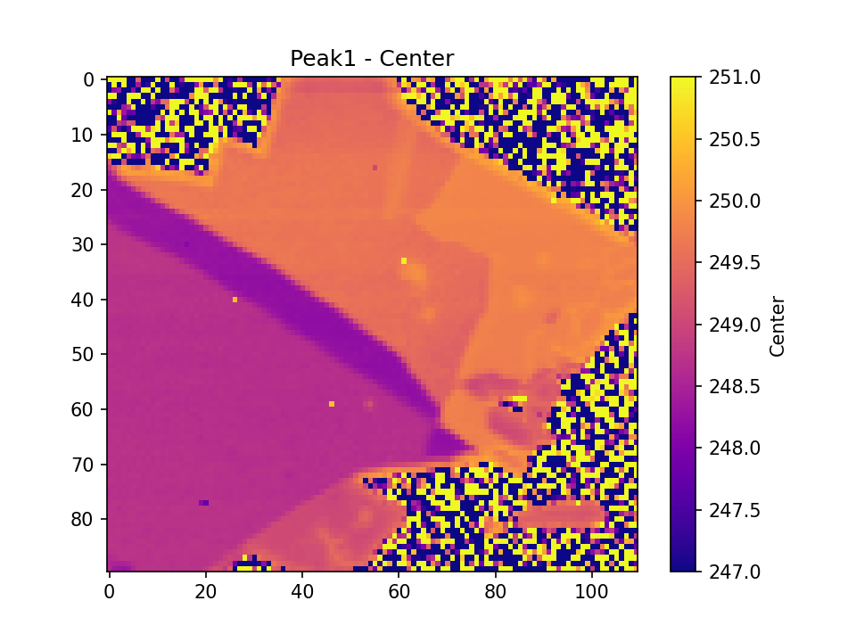
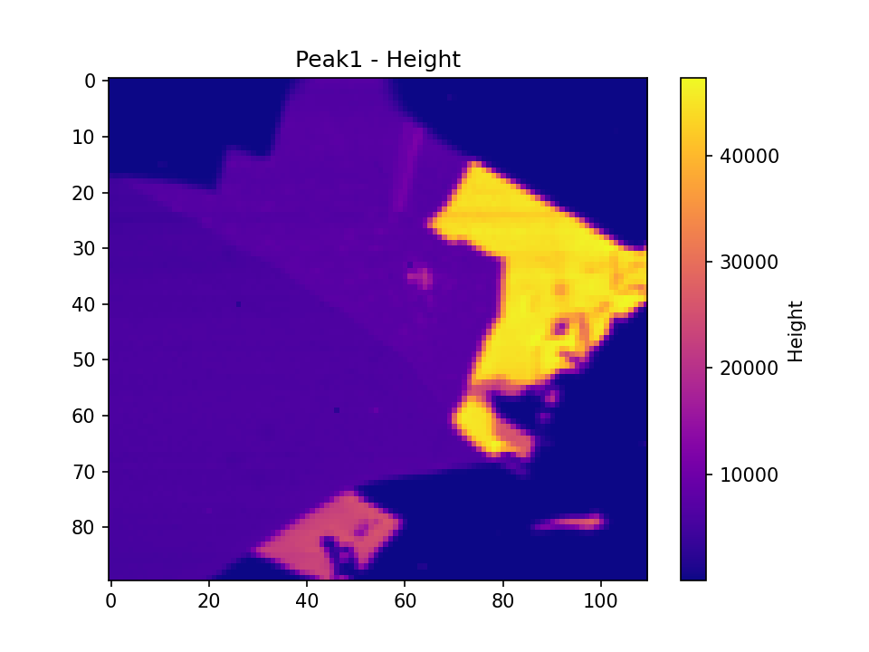
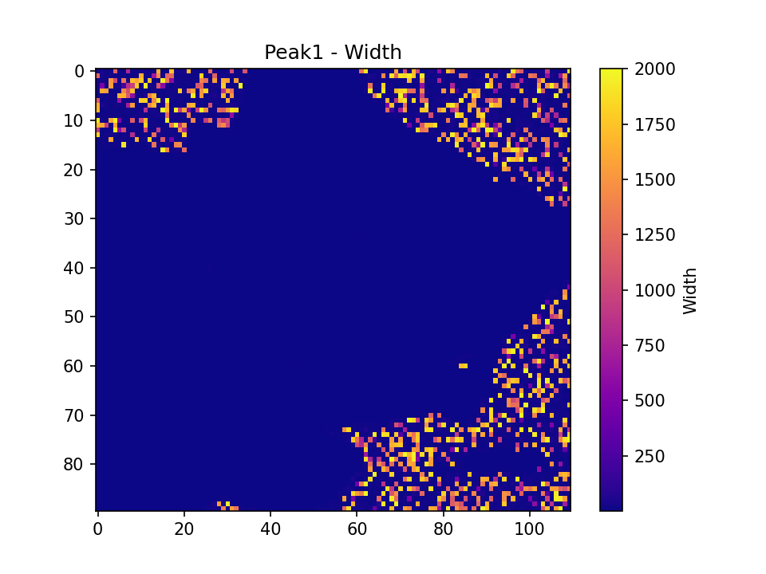

# Spectra Analysis App – Quick-Start Guide

A **desktop application** (Windows `.exe`) that:
- Loads a space-delimited text file containing spectral data (exported from WITec).
- Performs **ALS baseline correction** and **Lorentzian peak fitting** for two separate peaks.
- Generates **heatmaps** (e.g., peak center, height, width).
- Saves an **Excel** results file and optional plots of each spectrum’s fit.

---

## Table of Contents

1. [Purpose](#purpose)  
2. [Preparing Data in WITec](#preparing-data-in-witec)  
3. [Launching the App](#launching-the-app)  
4. [Selecting the Input `.txt` File](#selecting-the-input-txt-file)  
5. [Selecting the Output Directory](#selecting-the-output-directory)  
6. [Specifying Parameters](#specifying-parameters)  
7. [Running the Analysis](#running-the-analysis)  
8. [Reviewing the Outputs](#reviewing-the-outputs)  
9. [Troubleshooting & Tips](#troubleshooting--tips)  
10. [Adding Images to Your GitHub README](#adding-images-to-your-github-readme)

---

## 1. Purpose

This application automates **peak analysis** on large spectral datasets:

- Loads a `.txt` file (exported from **WITec**, single-file format).  
- Allows you to **define two peaks** (Peak #1 and Peak #2) with custom regions, baseline parameters, and Lorentzian fit bounds.  
- Performs **Asymmetric Least Squares (ALS) baseline correction** plus **Lorentzian fitting** for each column in the file.  
- Saves:
  - **Heatmaps** for each peak: `Peak1_Center.png`, `Peak1_Height.png`, `Peak1_Width.png` (and similarly for Peak #2).  
  - An **Excel** file with the extracted peak parameters (height, width, center).  
  - (Optionally) **fitted-spectra** plots for every column/spectrum if you check “Save Fitted Spectra.”

---

## 2. Preparing Data in WITec

1. **Locate** your Raman mapping data in the WITec Project.  
2. **Right-click** the mapping data → **Export → Table**.  
3. In **Export Filter File Info**:
   - Choose **Export into one file**.  
   - Provide a filename (e.g., `MappingData.txt`).  
   - Click **OK**.  
4. The resulting file should have:
   - **First column** = x-axis (wavenumber or wavelength).  
   - **Subsequent columns** = intensities for each spectrum in the map.  
5. Check your **Points per Line** and **Lines per Image** in WITec for correct 2D map reshaping in the app.

---

## 3. Launching the App

1. **Double-click** the `.exe` file (e.g., `SpectraAnalysisAppAdvanced.exe`).  
2. A main window appears with:
   - **File/Folder Selection**  
   - **Theme** dropdown  
   - Parameter frames for **Peak #1** and **Peak #2**  
   - A **plot area** for the average spectrum  

If Windows prompts about unknown publishers, click **Run Anyway** if you trust this software.

---

## 4. Selecting the Input `.txt` File

1. Click **Browse** next to **Select .txt File**.  
2. Choose your `.txt` exported from WITec (the one-file export).  
3. The app will load the data and display the **average spectrum** on the right.

---

## 5. Selecting the Output Directory

1. Click **Browse** next to **Select Output Directory**.  
2. Pick (or create) a folder where the analysis results—heatmaps, Excel files, optional fitted plots—will be saved.

---

## 6. Specifying Parameters

You’ll see multiple frames and input fields on the left:

- **Points per Line** / **Lines per Image**  
  - Must match your WITec scan for correct 2D reshaping.  

- **Peak #1 Definition** and **Peak #2 Definition**:
  - **Region Start / End**: x-range for baseline correction and fitting.  
  - **ALS lam / p**: Parameters for Asymmetric Least Squares baseline.  
  - **Mask intervals** (optional): x-ranges where the baseline is forced to follow the data.  
  - **Lorentzian Fit Bounds**:
    - Position [min, max]  
    - Width [min, max]

> **Preview Baseline**: Click **Preview Baseline Correction (Peak 1)** or **(Peak 2)** to see how the average spectrum is corrected in the chosen region.

---

## 7. Running the Analysis

Click **Analyze Full Data**:

1. The program iterates over each **column** of the input (each spectrum).  
2. For both Peak #1 and Peak #2, it:
   - Extracts the spectral region (Start–End).  
   - Performs **ALS baseline correction**.  
   - Fits a **single Lorentzian** with the user-specified bounds.  
3. It reshapes the results into 2D arrays (if you gave valid Points/Lines).  
4. A progress bar updates until complete.  
5. On success, a popup says **“Analysis complete! Results saved.”**

---

## 8. Reviewing the Outputs

Within your **Output Directory**, you’ll see subfolders:

- **`Peak1_XX.XX`** (and **`Peak2_YY.YY`**):  
  - `.png` heatmaps of **Height**, **Width**, **Center** (for each peak).  
  - An Excel file (`Peak1_results.xlsx`, `Peak2_results.xlsx`) listing the fitted parameters.  

- **`Substraction`**:  
  - If you chose Peak1 - Peak2 or Peak2 - Peak1, you’ll find difference heatmaps and an Excel file with differences.

- **`Fitted_Spectra`** (if *Save Fitted Spectra* is checked):
  - Individual `.png` plots showing each spectrum’s baseline + Lorentzian fit.

### Example Heatmaps

Below are **three** images (for Peak #1) that typically appear after analysis:

  
  

These visualizations show how the **center**, **height**, and **width** of Peak #1 vary across your 2D scan.

---

## 9. Troubleshooting & Tips

- **Invalid Data**: Ensure the first column of your `.txt` is the x-axis, and each subsequent column is a spectrum.  
- **Mismatched Points/Lines**: If you see errors reshaping data or weird heatmaps, confirm the **Points per Line** and **Lines per Image** are correct from your WITec scan details.  
- **Long Running**: Large files + differential evolution fitting can take time. Watch the progress bar.  
- **Bounds**: If your peak position/width is outside the specified range, the fit may fail or look off. Adjust if needed.  
- **Save Fitted Plots**: This can generate many `.png` files (one per spectrum). Use with caution for large datasets.  
- **No .exe?**: Make sure you’re running the compiled `.exe` version (or run `python main_app.py` if you have the script and dependencies installed).
